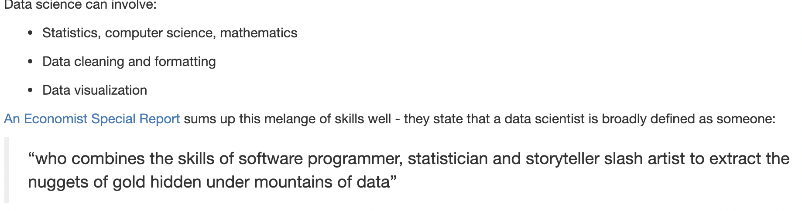
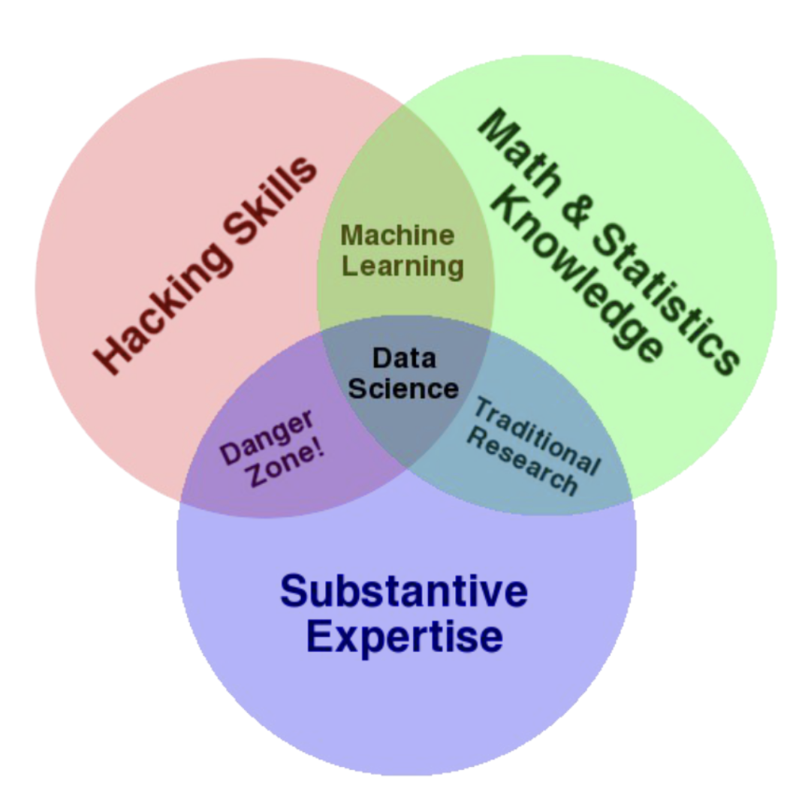

### What is data science?

- data science is using data to answer questions.

### What is data scientist?

- a data scientist is somebody who uses data to answer questions.

### Data

- data is collected, examined and most importantly, used to inform decisions.
- A set of values of qualitative or quantitative variables.

### Getting help

#### 1befor asking for help

- manual
- StackOverflow
- CrossValidated

#### 2error type

##### 2.1your command produces no data and spits out an error message

- typos
- Error message and make sure u understand it
- google

##### 2.2your command produces an output, but it is not at all what you wanted

- consider how the output was different form what u expected
- Think about what it looks like the command actually did, why it would do that, and not what u wanted

#### 3Rubber duck debugging

“Rubber duck debugging” is a long held tradition of solitary programmers everywhere. In the book “The Pragmatic Programmer,” there is a story of how stumped programmers would explain their problem to a rubber duck, and in the process of explaining the problem, identify the solution.

#### 4How to ask questions

- The question you are trying to answer

- How you approached the problem, what steps you have already taken to answer the question

- What steps will reproduce the problem (including sample data for troubleshooters to work from!)
-  What was the expected output
-  What you saw instead (including any error messages you received!)
- What troubleshooting steps you have already tried
- Details about your set-up, eg: what operating system you are using, what version of the product you have installed (eg: R, Rpackages)
- Be specific in the title of your questions!

### Data science process

- 1Questions about data to be answered?

- 2find or get the data

- 3analyze data by exploring and modeling data

- 4draw conclusions

- 5communication. Report/blog post/pre, etc.

